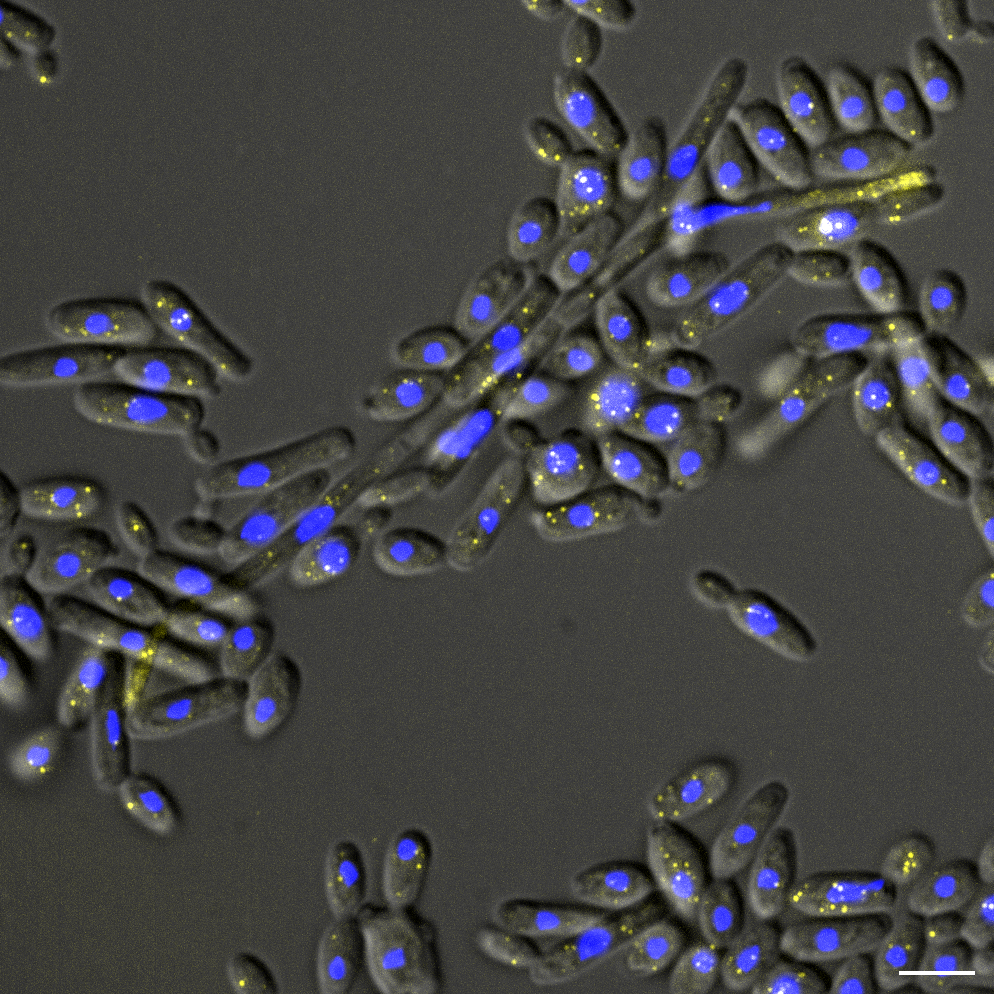

# C.albicans smFISH pipeline

This GitHub repository consist of .ipynb files used for the data analysis of the VU systems biology O2 building ET laboratory C.albicans project. These notebooks where used in the anylsis of the article titled: "single-molecule Fluorescent In Situ Hybridization (smFISH) for RNA detection in the fungal pathogen Candida albicans".
It consist of the following notebooks:

Notebooks
  1. 01-npy_to_tif_conversion
  2. 02-spot_detection
  3. 03-spot_decomposition
  4. 04-spot_assignment

For description of the code look at the corresponding number underneath:

 1. Cellpose outputs its segmentation masks as .npy files. These can be converted to the easier to work with tif-format using this notebook. 
 
 
 2. In order to quantify the number of RNAs in your images a Laplacian of Guassian kernel is applied to to detect high-intensity spots from background.
 

 3. Dense or high intensity spots can be composed of several RNAs. Here, the median spot intensity is used to decompose these dense regions into an estimate of the number of RNAs.
 
 
 4. The assignment of detected RNAs to a cell-mask id. Cellpose outputs a Mask file in which every cell is given a unique cell mask value. Here, the detected RNA coordinates are used to count the number of RNAs per unique cell mask id.

Example of FISH image (scalebar 5 µm):

spots indicate fluorescently labelled CLB2 mRNA in the SC5314 WT strain grown in SPIDER medium at 37 degrees (celsius).

# requirements and installation
In order to install the necessary packages and start jupyter notebook type in your terminal:

1. cd /this/cloned or downloaded/github/repo
2. conda env create --name FISH --file FISH.yml
3. conda activate FISH
4. cd notebooks 
5. jupyter notebook
 
# Example dataset
Example dataset is avalaibe at https://zenodo.org/record/8288705. For the full dataset used for the analysis performed in the linked article see https://zenodo.org/record/8260668. 
